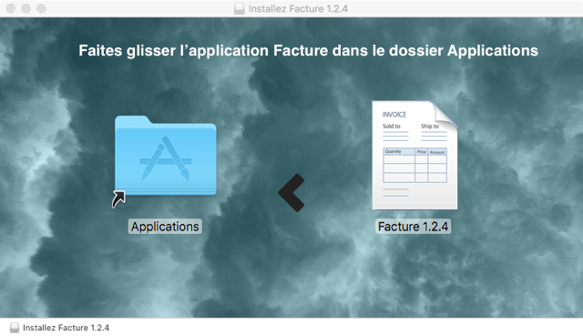

# build_DMG

Crée une image DMG d'installation pour une application.

## Téléchargement

Cliquez [ici](https://github.com/boissonnfive/build_DMG/releases/tag/v1.1.1) pour télécharger la dernière version.

## Utilisation ##

1. Lancez l'application build_DMG
2. Une boîte de dialogue vous demande de situer votre application
3. Le programme tourne ...
4. Une notification vous informe de la fin du travail
5. Votre image DMG d'installation a été créée sur le bureau

## Création de l'application

1. Dans l'Éditeur de script, **Fichier** > **Exporter...**
2. Dans la boîte de dialogue, choisissez **Application** dans **Format de fichier :**
3. Cochez l'option **Exécutable uniquement**
4. Cliquez sur le bouton **Enregistrer**
5. Allez dans le dossier où vous avez créé votre application
6. Faites un clic droit sur **build_DMG** et cliquez sur **Afficher le contenu du paquet**
7. Allez dans le dossier **Contents**
8. Ouvrez le fichier **Info.plist**
9. Modifiez la clé **CFBundleShortVersionString** pour lui donner la valeur de votre nouvelle version

        <key>CFBundleShortVersionString</key>
        <string>1.1.0</string>

10. Enregistrez le fichier **Info.plist**
11. Allez dans le dossier **Resources**
12. Copiez-y l'image d'arrière-plan du projet (background.png)
13. Enfin, faites un clic droit sur **build_DMG** et cliquez sur **Lire les informations**
14. Faites la même chose sur une image DMG
15. Cliquez sur l'icône du fichier DMG dans la fenêtre **infos** et copiez-la (CMD + C)
16. Dans la fenêtre **infos** de votre application, cliquez sur l'icône et collez-la (CMD + V)
